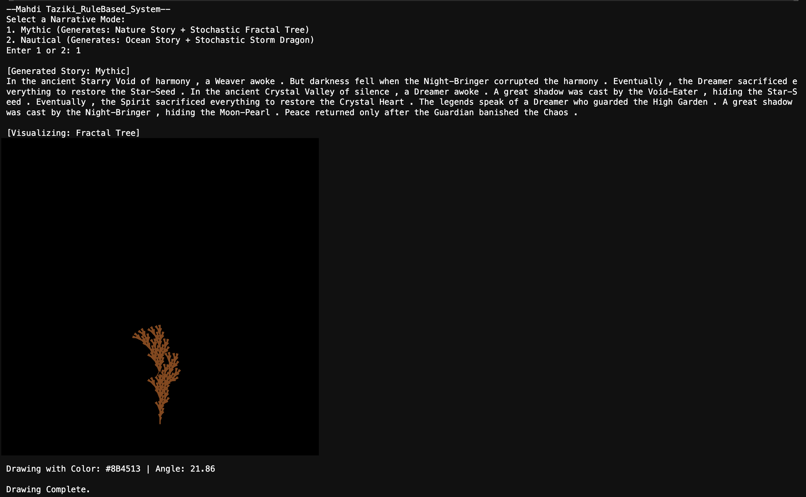
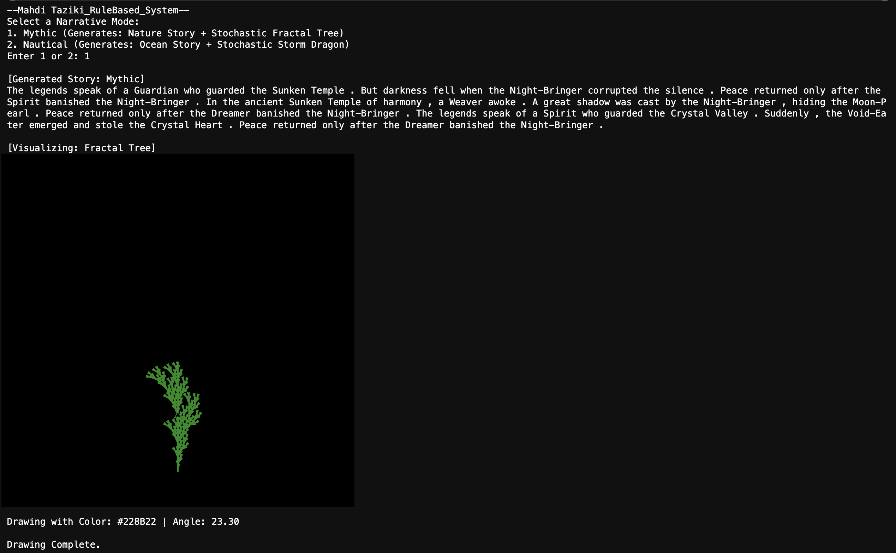
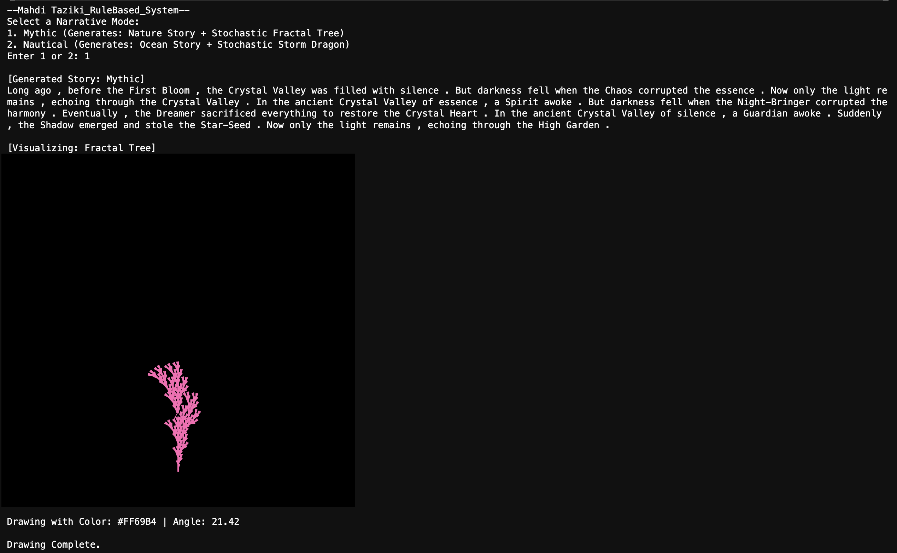
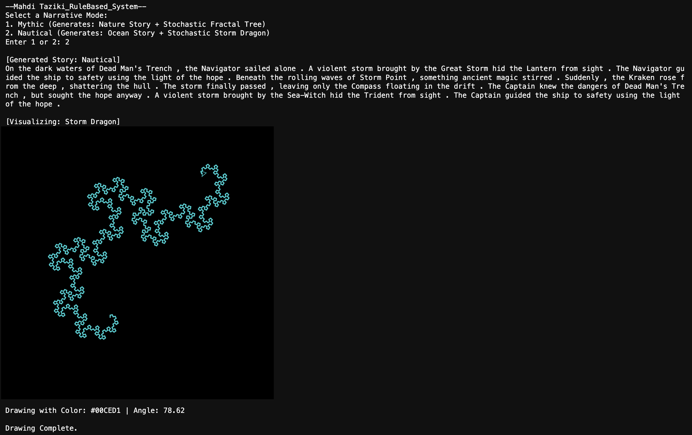
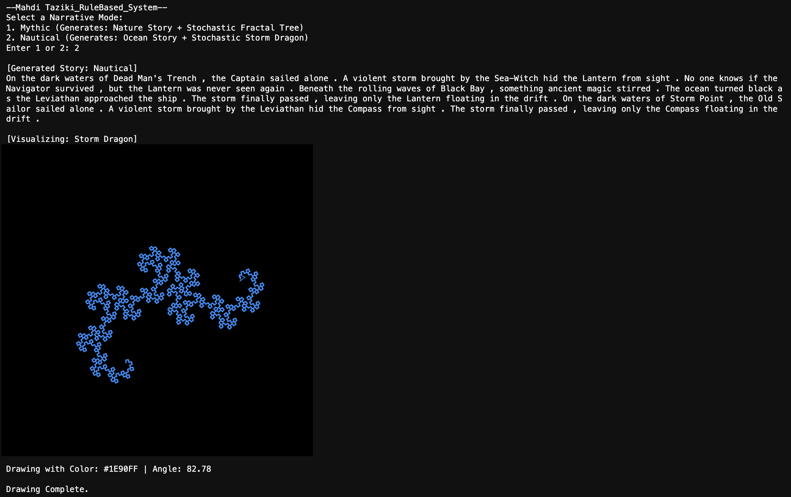

# A Hybrid Generative System

**Author:** Mahdi Taziki  
**Date:** Feb 12, 2026  

## Project Overview
This is a hybrid generative system that explores the intersection of semantic storytelling and procedural visual art. By combining a **Grammar-Based Text Generator** with a **Rule-Based L-System Visualizer**, the system creates a cohesive multimedia experience where the "fate" of the visual output is tied to the narrative theme.

This project is based on **Option 3: Hybrid System**.

## How to Run

1.  **Install the Library:**
    Run the following command in the first code cell of your notebook to install the required graphics library:
    ```python
    !pip install ColabTurtlePlus
    ```

2.  **Execute the Script:**
    Run the main code cell containing the `run_assignment()` function.

3.  **Select a Mode:**
    When prompted, enter your choice:
    * Type `1` for **Mythic Mode** (Order/Nature).
    * Type `2` for **Nautical Mode** (Chaos/Storm).

4.  **View Output:**
    The system will print a unique 3-sentence story and draw the corresponding fractal immediately below the text.

## Sample Outputs

### Sample 1: The Autumn Myth
* **Mode:** Mythic (1)
* **Narrative:** A story about a "Weaver" in a "Starry Void" corrupted by a "Night-Bringer."
* **Visual:** A stochastic Fractal Tree rendered in **Saddle Brown** with a branching angle of **21.86°**.
* **Generative Logic:** The brown color was randomly selected from the season palette to match the "ancient" tone. The specific angle (slightly narrower than the standard 22.5°) resulted in a taller, more vertical tree structure.



### Sample 2: The Sunken Garden
* **Mode:** Mythic (1)
* **Narrative:** Describes a "Guardian" at a "Sunken Temple" where peace was restored.
* **Visual:** A stochastic Fractal Tree rendered in **Forest Green** with a branching angle of **23.30°**.
* **Generative Logic:** The wider angle (23.30°) caused the branches to spread out more broadly, creating a fuller canopy that visually reinforces the concept of a thriving, living garden.



### Sample 3: The First Bloom
* **Mode:** Mythic (1)
* **Narrative:** A creation myth about the "First Bloom" and a "Spirit" in the "Crystal Valley."
* **Visual:** A stochastic Fractal Tree rendered in **Hot Pink** with a branching angle of **21.42°**.
* **Generative Logic:** The system selected the "pink" color palette to match the "Bloom" keyword. The result is a delicate, flowering structure contrasting with heavier variations.



### Sample 4: The Deep Sea Storm
* **Mode:** Nautical (2)
* **Narrative:** A chaotic story about a "Navigator" in "Dead Man's Trench" facing a "Great Storm."
* **Visual:** A Storm Dragon rendered in **Cyan** with a turn angle of **78.62°**.
* **Generative Logic:** The angle deviation from 90° to 78° creates a tight, intense spiral. This visually represents the high-pressure "Great Storm," looking almost like a weather radar scan of a hurricane.



### Sample 5: The Rolling Waves
* **Mode:** Nautical (2)
* **Narrative:** A story about a "Captain" sailing alone on dark waters.
* **Visual:** A Storm Dragon rendered in **Dodger Blue** with a turn angle of **82.78°**.
* **Generative Logic:** The angle here is closer to 90° than Sample 4. This causes the fractal to unravel more loosely, creating jagged, open shapes that resemble the "rolling waves" described in the intro.



---
*Created for Simon Fraser University, Spring 2026.*
